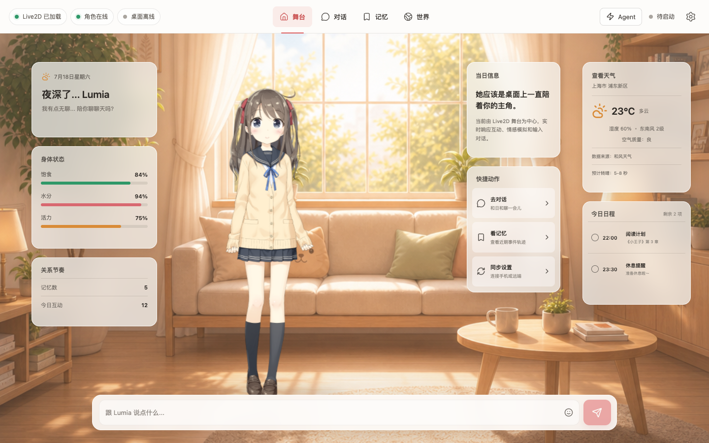

<p align="center">
  
</p>

<h1 align="center">NekoPapa</h1>

<p align="center">一个同时运行于应用小屋和独立桌面舞台的 Live2D 桌面伴侣。</p>

<p align="center">
  <a href="https://github.com/Hisakazu333/NekoPapa/actions/workflows/ci.yml"></a>
  <a href="LICENSE"></a>
  <a href="https://github.com/Hisakazu333/NekoPapa/stargazers"></a>
  
</p>

<p align="center"><a href="README_EN.md">English</a> · 简体中文</p>

NekoPapa 将 React 控制台、Tauri 桌面能力和 C++ Live2D Native Stage 组合成一个桌面应用。当前源码聚焦小屋、角色渲染和 Stage 生命周期。对话、记忆、世界与 Agent 页面仍是产品原型，不代表后端服务已经接通。

> [!IMPORTANT]
> NekoPapa 处于开发预览阶段。源码构建成功不代表安装包、签名、公证、Windows 运行或发布质量已经验证。

<p align="center">
  
</p>
<p align="center"><sub>当前浏览器预览。天气、身体、日程等卡片使用等待后端 adapter 替换的 mock 数据；浏览器不会启动 Native Stage。</sub></p>

## 项目状态

下表只描述当前源码中能够确认的能力：

| 模块 | 当前状态 | 技术边界 |
| --- | --- | --- |
| 桌面主窗口 | 开发中 | Tauri 2 + Rust + React + TypeScript，使用原生标题栏 |
| 小屋 Live2D | 已接入开发模型 | Pixi.js + Cubism Web，在 WebView 中渲染 |
| Native Stage | macOS/Windows 构建已通过 | C++17 + GLFW + OpenGL + Cubism Native，运行于独立窗口；Windows 运行时尚未验证 |
| Stage 生命周期 | 基础控制已实现 | Rust host 启动、查询和停止 sidecar |
| Nekonano-Aether（NNA）/ NekoCore-Nano layer | Stub 模式 | Native Stage 尚未接入完整 NekoCore-Nano 领域状态 |
| Stage Protocol v1 | 草案 | JSON Schema 已存在，运行时仍使用未版本化 v0 消息 |
| 对话、记忆、世界、Agent | 界面原型 | 没有完整服务、权限和持久化闭环 |
| Legacy Qt | Frozen | 仅用于迁移取证，不是可构建回退产品 |

仓库使用 Live2D 官方示例模型桃濑日和进行开发验证。它不是 Lumia 的正式角色资产。

当前 `main` 已在 GitHub CI 完成前端、Rust、仓库卫生以及 macOS/Windows Native Stage 构建。macOS Apple Silicon 已用真实模型完成 3 帧有界 health check（`model_loaded: true`、`gl_error: 0`）；Windows 目前只有构建证据，不包含窗口交互或安装包验证。

## 快速开始

浏览器预览需要 Node.js 24、随 Node 提供的 npm，以及支持 WebGL 2 的现代浏览器。它适合开发 React 小屋和 Cubism Web，不会启动真实 Native Stage，页面中的 Stage 状态是模拟值。

```bash
git clone https://github.com/Hisakazu333/NekoPapa.git
cd NekoPapa
npm --prefix app/control-desktop ci
npm --prefix app/control-desktop run dev
```

打开 `http://127.0.0.1:1420/`。

### 运行桌面应用

桌面应用还需要 Rust 1.96+、CMake 3.21+、C++17 工具链、OpenGL、Ninja（推荐）和 [Tauri 2 平台依赖](https://v2.tauri.app/start/prerequisites/)。Windows 使用 Visual Studio 2022/MSVC，macOS 使用 Xcode 工具链。

```bash
npm --prefix app/control-desktop ci
npm --prefix app/control-desktop run tauri -- dev
```

Tauri 会先构建与当前 Rust target triple 匹配的 Native Stage sidecar。首次配置可能从 GitHub 下载固定版本的 GLFW 和 nlohmann/json。

当前平台边界：

- **macOS**：CI 构建通过；Apple Silicon 真实模型 health check 通过；安装包、签名和公证未验证。
- **Windows x64**：Visual Studio 2022 CI 构建通过；运行时窗口与安装包未验证。
- **Linux**：仅保留源码开发路径，不是当前承诺发布平台。

完整环境、Native Stage 单独构建和故障排查见 [开发环境指南](doc/contributing/development-environment.md)。

## 运行时架构

NekoPapa 有两个独立 Live2D 渲染面：

```text
React UI ── typed bridge ──> Tauri / Rust host ── lifecycle ──> Native Stage
    │                                                            │
    └── Cubism Web / Pixi.js                                     └── Cubism Native / OpenGL
```

- **WebView 角色**：参与页面布局、裁剪和输入
- **Native Stage 角色**：运行于独立桌面窗口
- **Tauri host**：拥有窗口、权限、资源路径和 sidecar 生命周期
- **NNA / NekoCore-Nano layer**：目标上拥有可持久的同伴状态，当前仍是 Stub 阶段

阅读 [桌面运行时边界](doc/architecture/desktop-runtime-boundaries.md) 了解状态所有权、协议和安全约束。

## 命名约定

NekoPapa 是当前产品、桌面包和仓库的唯一名称。Nekonano-Aether（NNA）与 NekoCore-Nano 指同一底层体系：NNA 用于 C++ `nna` 命名空间、`NNA_` 构建选项和工程前缀，NekoCore-Nano 是核心名称；界面中的 `NekoCore` 是该核心的短称。当前公开仓库默认只构建 Stub，不包含完整 Core 实现，也不提供完整 Core 的下载。`source`/`binary` 接入模式需要调用方另行提供经过授权的源码或二进制。

源码中的 `openneko` CMake target、binary 和 namespace 是待迁移的 legacy 技术标识。它们只在命令或迁移文档中出现，不应进入新产品文案、页面标题或新文档名称。

## 仓库结构

| 路径 | 责任 |
| --- | --- |
| `app/control-desktop/` | React 主窗口、Tauri host 和桌面打包配置 |
| `app/live2d-stage/` | 独立 C++ Native Stage |
| `app/stage-desktop/` | Frozen Legacy Qt 取证目录 |
| `engine/` | NNA / NekoCore-Nano C++ stub 与 Cubism Native adapter |
| `protocol/stage/v1/` | Stage JSONL v1 草案与 fixtures |
| `assets/` | 运行时与开发资产 |
| `img/` | 产品原型源图，不进入安装包 |
| `doc/` | 治理、工程、架构和产品文档 |

当前目录债务和渐进目标结构见 [项目结构与分层](doc/architecture/repository-layout.md)。

## 开发与治理

仓库使用短分支通过 Pull Request 合入受保护的 `main`，不维护长期 `dev` 分支。人工工作分支遵循 [GOVERNANCE.md](GOVERNANCE.md#4-分支与合并模型) 的完整前缀清单；Dependabot 等受控自动化分支是明确例外。合并只允许 squash，成功后自动删除远端分支。

- [贡献指南](CONTRIBUTING.md)
- [项目治理](GOVERNANCE.md)
- [NNA 工程规范](doc/engineering/standards.md)
- [Issue 治理与首批 backlog](doc/ISSUES.md)
- [安全策略](SECURITY.md)

## 文档

- [文档中心](doc/README.md)
- [产品原型基线](doc/product/README.md)
- [桌面 UI 架构与验收](doc/product/desktop-ui-architecture.md)
- [桌面架构](doc/architecture/README.md)
- [构建与测试门禁](doc/architecture/build-and-test-gates.md)
- [Stage Protocol v1](protocol/stage/v1/README.md)

## 问题与支持

- [提交 Bug、功能建议或架构问题](https://github.com/Hisakazu333/NekoPapa/issues/new/choose)
- [查看当前 Issues](https://github.com/Hisakazu333/NekoPapa/issues)
- [安全漏洞私密报告流程](SECURITY.md)
- [Pull Requests](https://github.com/Hisakazu333/NekoPapa/pulls)

## 许可证与第三方资产

根 [LICENSE](LICENSE) 是 Apache License 2.0。部分历史源码仍保留旧的文件级许可证头，当前不做重许可；发布前必须按文件来源、许可证标识和第三方清单完成审计。

Live2D Cubism SDK、Cubism Core 和桃濑日和示例模型适用各自许可与再分发条款，不由 Apache-2.0 覆盖。发布安装包前必须完成第三方清单和包内容审计。阅读 [Live2D 资产说明](assets/live2d/README.md) 获取当前来源信息。
